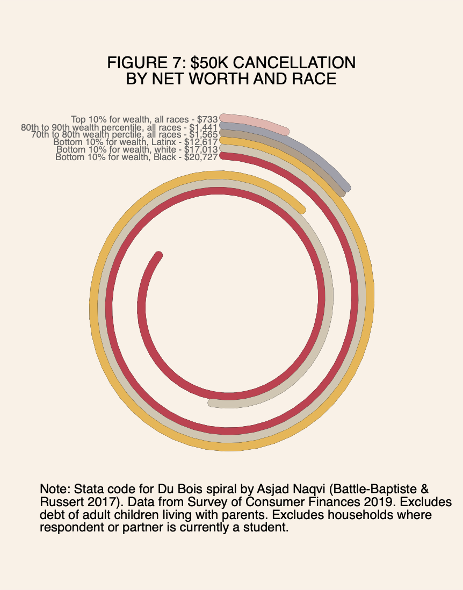

## Student Debt Cancellation IS Progressive: Correcting Empirical and Conceptual Errors

### By Charlie Eaton, Adam Goldstein, Laura Hamilton, and Frederick Wherry

Summary: Analysis of household wealth data shows that student debt cancellation—at all proposed levels—is progressive.

**Data**
  - Survey of Consumer Finances

**Citation**
Eaton, Charlie, Adam Goldstein, Laura Hamilton, and Frederick Wherry. "Student Debt Cancellation IS Progressive: Correcting Empirical and Conceptual Errors." Available at SSRN 3909430 (2021). https://rooseveltinstitute.org/wp-content/uploads/2021/06/RI_StudentDebtCancellation_IssueBrief_202106.pdf

**Abstract**
We address the myth of student loan cancellation regressivity: the idea that student debt cancellation is regressive because it involves a public transfer to a relatively well-off group—those with some college education. We show that the regressive cancellation myth rests on a series of misleading methodological foundations: including private student loans in calculations of cancellation, conditioning analyses on borrowers only, focusing primarily on debtors’ income rather than wealth, basing calculations on the value of debt to the government rather than the value to borrowers, and ignoring the racial distribution of debt.

**Code**
All replication code is in Stata but is provided and executed in Jupyter Notebooks (.ipnynb) using a Stata Kernel. For details see: https://kylebarron.dev/stata_kernel/

Each .ipynb Notebook file begininning with "f" in the repository includes both code for all of our analyses and the graphs they produce. The .ipynb file beginning with "d" downloads source data from the Survey of Consumer Finances and builds the data set for all of our analyses. Some notebooks, such as "f3_cancellationbyassets.ipynyb" include code and redering for alternate versions of figures and analyses that we include in the paper.

The "figures" directory of the repository contains .pdf outputs of each figure in our paper. The "data" directory contains data files downloaded and generated for the analysis.

We render all figures in the paper using the color palette, other style elements, and categorical data visualization techniques employed by W.E.B Du Bois in 1900 to analyze the impacts of slavery, emancipation, and Jim Crow on Black social and economic life (Battle-Baptiste and Russert 2017). For more information on Du Boisian data visualization see https://www.dignityanddebt.org/projects/du-boisian-resources/.

Figure 7 plots mean debt cancellation under the Warren-Schumer plan by net worth and race for selected net worth deciles. The disparities are so large that student debt bars for the bottom decile would run off the page in a bar graph that also plotted the minimal student debts of top net worth deciles. We instead use the Du Bois spiral developed in 1900 to solve similar scaling problems when graphing radical shifts in Black household wealth after emancipation.

